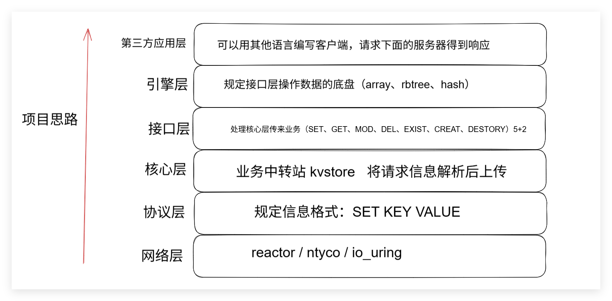

KV存储项目

一.网络层（reactor.c reactor.h）：使用reactor模式框架，实现多路复用，实现高并发，也可以用协程或io_uring实现;

1.我们现在需要在收发recv和send中间加上一层 parser数据业务解析，如何达到一个最好的封装效果？

答：将原先tcp_server的实现代码reactor.c中的main函数换成reactor入口函数，传入的第二个参数是一个parser函数的指针。这样在recv接收到数据后，可以直接通过这个函数指针调用parser函数，做到网络层IO（reactor.c）与业务(kvstore.c)的分离。

二.协议层和主函数（kvstore.c）：就是如何处理SET KEY VALUE。首先将SET KEY VALUE通过空格分开，然后遇到不同SET，处理不同业务。

三.核心层和接口层（array.c）:用于存储key-value，实现增删改查。

四.引擎层（kvstore.h array.c）:定义什么数据结构