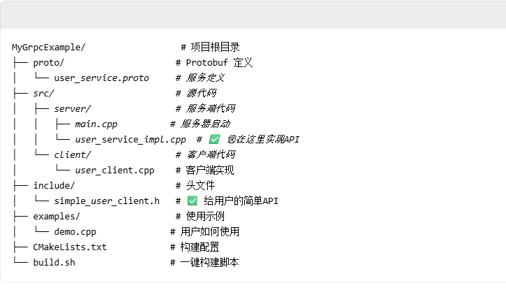

/*通过grcp，相当于封装一个库，用户就可以直接使用这个库，不需要关心底层实现。如果直接包含.h文件，用户需要知道底层实现，才能使用，所以封装库，用户只需要知道接口，就可以使用，不需要知道底层实现(比如.h文件里面要用到这个库，那个库，那用户用你的.h文件还需要下载这些库，还要担心兼容什么的，麻烦)。
*/

//配置grcp和protobuf，及写grcp流程文章
https://blog.csdn.net/you_fathe/article/details/128192504?spm=1001.2014.3001.5506

//完整grcp项目流程

1.先写.proto文件，定义协议及接口

2.通过protoc命令生成.h文件和.cc文件还有.grpc.pb.h 和 .grpc.pb.cpp 文件

3.user_service_impl.cpp  #您在这里实现具体API

4.simple_user_client.h   #给用户的简单API接口

5.demo.cpp              # 展示用户如何使用

6.CMakeLists.txt            # 构建配置
  build.sh                  # 一键构建脚本

//通过打包好后，用户只要下载这个包，然后包含simple_user_client.h 这个头文件，就可以使用api了。

//多函数多类调用
1. .proto文件多创建几个服务

2. .h文件里声明重写函数

3. .cc文件里实现具体函数